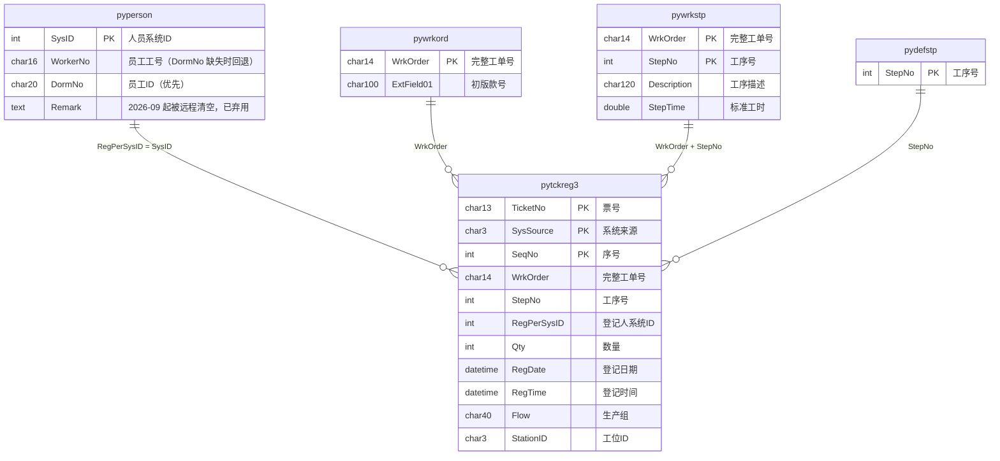

# PCI 看板框架 & 前后端数据映射

> 适用代码基线：`D:\iwork`（Django 5.2 项目，应用目录 `iwork\`）
> 说明：本文档由两部分组成——**第一部分：看板框架说明书**；**第二部分：数据库映射与前后端数据映射**（含三库路由、表字段映射、页面 ↔ API ↔ 前端字段对照）。

---

# 第一部分：框架说明书

## 1. 项目概述

PCI 看板（iwork）是一个服装工厂生产数据看板系统，面向 PCI 工厂管理层与班组长，提供：

- **实时生产看板**：今日产量、每小时产量趋势、工序产量对比、工单明细（Redis 版本化读模型 + SSE 实时推送）。
- **生产详情页**：按生产线（Flow）/ 工序（StepNo）/ 初版款号 / 产品名称四维度下钻，员工级明细与目标达成率。
- **历史数据回看**：历史日期产量统计（本地快照表，按需构建，可追溯）。
- **今日目标管理**：班组长每日提交各分组目标产量与工时，含截止时间、逾期与责任人义务跟踪。
- **站内通知中心**：目标义务每日汇总、状态变化实时通知（SSE）。
- **产量看板（已下线）**：kanban.html 与 `api/kanban/*` 接口保留但导航入口已注释，未上线。

## 2. 技术栈

| 层次 | 技术 |
|---|---|
| 后端 | Django 5.2 + djangorestframework |
| 异步任务 | Celery 5.3 + Redis broker（db1）/ result（db2）+ django-celery-beat |
| 数据库 | MySQL（三库：系统库 / 远程业务只读库 / 本地业务库）、SQLite（一次性导入源） |
| 缓存 | django-redis（db0，KEY_PREFIX=`iwork`） |
| 实时推送 | Redis Pub/Sub + SSE（`EventSource`） |
| 运行 | uvicorn（异步） + eventlet；Docker 容器 `DKT_iwork`（端口 8000 仅内网 `docker_dkt-net` 暴露） |
| 前端 | Vue 3（CDN，分隔符 `{[ ]}`）+ Tailwind CSS（CDN）+ Chart.js 4（CDN），无构建步骤 |
| 身份 | Keycloak（Nginx 反向代理注入 `Remote-*` 头，Django 校验可信 IP 后解析身份） |

## 3. 目录结构

```
D:\iwork\
├── manage.py                     # 管理入口；按 argv 自动设 IWORK_PROCESS_ROLE（runserver→web，其他→management）
├── requirements.txt              # 开发依赖
├── requirements-prod.in/.lock    # 生产锁定依赖（Dockerfile --require-hashes 安装）
├── Dockerfile                    # python:3.11-slim，非 root 用户 iwork(10001)，端口 8000
├── docker-compose.yml            # iwork(DKT_iwork) + alert-worker(DKT_iwork_alert_worker)
├── docker-compose.proxy.yml      # 代理配置
├── deploy.ps1 / restart_services.ps1 / stop_services.ps1 / uninstall_services.ps1
├── entrypoint.sh / start.sh      # 容器启动：chown 后 setpriv 降权执行 uvicorn/celery/beat
├── env\local.env / production.env  # 环境配置（不含密码，密码在相邻工作区 dkt-secrets.env）
├── sqlite\production_orders.db   # 生产订单一次性导入源（import_production_orders 命令）
├── static\iwork\notifications.js # 站内通知中心前端 JS
├── iwork\                        # Django 项目/应用合一目录
│   ├── settings.py               # 项目配置（350 行，见 §8）
│   ├── urls.py / api_urls.py / history_urls.py   # 路由（见 §6）
│   ├── views.py                  # 页面渲染视图
│   ├── api_views.py (2072 行)    # 看板数据 API
│   ├── api_views_account.py      # 账户/目标责任 API
│   ├── api_views_local.py        # 历史快照 API
│   ├── models.py                 # 远程只读模型（payroll 库）
│   ├── local_models.py           # 本地业务模型（iwork_local 库）
│   ├── alert_models.py           # 告警/通知模型（iwork_local 库）
│   ├── database_router.py        # 多库路由（见第二部分 §2）
│   ├── db_guard.py               # RemoteDatabaseAccessDenied 异常
│   ├── db_backends\guarded_mysql\base.py  # 进程角色级远程库访问守卫
│   ├── middleware.py             # TrustedProxyMiddleware + TargetSubmissionGateMiddleware
│   ├── identity.py               # IworkIdentity（Keycloak 身份封装）
│   ├── queries.py (1531 行)      # 远程库查询层（实时链路）
│   ├── historical_queries.py     # 本地历史快照查询层
│   ├── statistics.py             # 并行聚合引擎（batch 查询）
│   ├── sync.py                   # 旧式逐行全量同步（LocalPytckreg3）
│   ├── history_store.py          # 历史快照构建（事实表落库）
│   ├── tasks.py                  # Celery 定时任务（60s 快照刷新等）
│   ├── read_model\               # 版本化读模型（builder/fact_source/queries/schemas/store/errors）
│   ├── sse_events.py             # SSE 通知代理（SnapshotNotificationBroker 等）
│   ├── snapshot_request_lock.py  # 历史快照请求锁（request_token 所有权）
│   ├── alerts\                   # 告警服务（api/contracts/notification_events/service/tasks）
│   ├── templates\iwork\          # 前端模板（见第三部分）
│   └── management\commands\      # snapshot_history / import_production_orders / backfill_historical_initial_styles
├── tests\ / scripts\ / tools\ / docs\ / proxy\ / mysql-init\ / local_dev_db\
└── .github\workflows\deploy-iwork.yml   # 生产 GHCR 受控部署
```

## 4. 架构总览

```
                    ┌────────────────────────────────────────────────────────┐
  浏览器 (Vue3)     │  Nginx (Portal 统一入口 /iwork/)                        │
  ── HTTPS ───────► │   ├─ 注入 Keycloak 身份头 (Remote-Subject/User/Groups) │
                    │   └─ 转发 /iwork/* → DKT_iwork:8000 (仅内网)            │
                    └───────────────┬────────────────────────────────────────┘
                                    │
                    ┌───────────────▼────────────────────────────────────────┐
                    │  DKT_iwork (uvicorn, 角色=web)                         │
                    │  ├─ 页面渲染 views.py → templates\iwork\*.html         │
                    │  ├─ 数据 API api_views* → read_model\queries           │
                    │  │      ├─ 今日/未来 → Redis 版本化读模型(只读)         │
                    │  │      └─ 历史日期  → iwork_local 本地快照表(只读)     │
                    │  └─ SSE 推送 sse_events (Redis Pub/Sub 订阅)            │
                    └───────┬──────────────────────┬─────────────────────────┘
                            │                      │
              ┌─────────────▼──────────┐   ┌───────▼──────────────────────┐
              │ Redis (db0 缓存/读模型) │   │ iwork_local 库（本地业务）    │
              │       db1 Celery broker│   │ 目标/身份/历史快照/告警/订单  │
              │       db2 Celery result│   └──────────────────────────────┘
              └─────────────▲──────────┘
                            │
       ┌────────────────────┴────────────────────┐
       │ DKT_iwork_alert_worker (Celery, 角色=celery) │
       │ 及 beat：每60s 构建快照 → publish → 广播     │
       └────────────────────┬────────────────────┘
                            │ 只读（web 进程禁止访问）
              ┌─────────────▼──────────────┐
              │ 远程 MySQL payroll 库 (iwork 别名)│
              │ pytckreg3/pyperson/pywrkord/│
              │ pydefstp/pywrkstp           │
              └────────────────────────────┘
```

**核心设计原则：**
1. **双链路数据架构**：今日实时数据 = Celery 每 60s 从远程 `payroll` 聚合 → Redis 版本化快照 → web 只读 Redis；历史数据 = 每日 03:00（或按需 `ensure`）从远程聚合 → 落库 `iwork_local` 事实表 → web 读本地。**web 进程永远不碰远程库**（进程角色门禁 + 后端守卫双重拦截）。
2. **版本化读模型**：快照带 `snapshot_version`（`YYYYMMDD-HHMMSS-ffffff-uuid8`），发布先写各视图键再原子切换 `:current` 指针，读侧有软陈旧（120s）/硬陈旧（600s）判断；发布通知经 Redis Pub/Sub → 各 Web Worker 的 `SnapshotNotificationBroker` 广播 → 前端按版本去重应用。
3. **SSE 推送**：客户端 `EventSource` 连接 `api/dashboard/stream/`；全量负载（`?stepno=`）或轻量通知（`?mode=notification`）；心跳 15s、连接租约 60s（到期前发 `lease_expiring` 提示前端重连）；无通知时 60s 轮询补偿。

**关键数据位置速查（库.表 / Redis 键）：**

| 数据 | 位置 |
|---|---|
| 生产打卡事实（源头） | `iwork.pytckreg3`（只读；web 进程禁止访问，仅 celery/management 可读） |
| 人员/工单/工序主数据（源头） | `iwork.pyperson`、`iwork.pywrkord`、`iwork.pydefstp`、`iwork.pywrkstp` |
| 实时读模型快照 | Redis `iwork:read:v1:<date>:current`（下含 views：`realtime / processes / workorders / workorder_details / detail / kanban`；旧版指针 `:previous`，各键 TTL 172800s） |
| 快照发布频道（SSE 通知） | Redis Pub/Sub `iwork:read:v1:published` |
| 告警通知频道 | Redis Pub/Sub `iwork:alerts:v1:notifications` |
| 分组目标缓存 | Redis `group_target:<date>:<flow>`；旧格式 `targets:<date>`、`wo_targets:<date>` |
| 月趋势统计缓存 | Redis `batch_monthly:<年月>:<日期>`（TTL 30 天） |
| 历史日事实/元数据/同步状态 | `iwork_local.historical_production_fact`、`iwork_local.historical_step_snapshot`、`iwork_local.historical_sync_state` |
| 目标/义务/责任/身份 | `iwork_local.group_target_production`、`target_production`、`daily_target_obligation(+leader)`、`target_submission_policy`、`managed_flow_assignment`、`iwork_principal`、`group_target_audit_log` |
| 生产订单/产品信息 | `iwork_local.production_orders`、`iwork_local.igarment_production_orders` |
| 告警/通知 | `iwork_local.alert_rule / alert_subscription / alert_event / alert_audience / notification_receipt / notification_delivery / alert_evaluation_run` |

## 5. 核心模块职责

| 模块 | 职责 |
|---|---|
| `views.py` | 页面渲染。`dashboard`（服务端预取 `get_realtime_stats()` 填入 `stats_json` 首屏）、`history_dashboard`、`today_targets`、`production_detail` 系列（`initial_view` + `detail_type` + `detail_key` 区分四种页面形态）、`kanban_page` |
| `api_views.py` | 看板数据 API（统一模式：今日/未来读 Redis 读模型，历史日期读本地快照；无快照返回 404 `{code:'history_snapshot_not_found'}`；响应带 `X-Iwork-Snapshot-Version` / `X-Iwork-Generated-At` / `X-Iwork-Stale` 头） |
| `api_views_account.py` | 账户 `me`、今日目标 `today_targets`、Flow 分配管理、目标义务、目标策略；分配保存前经 Portal HTTP 复验账号 iwork 访问权 |
| `api_views_local.py` | 历史快照 API：`local_date_stats` / `available_dates` / `ensure_snapshot`（请求锁：已存在→200，构建中→202 `retry_after:2`） |
| `read_model\` | `fact_source.collect()` 在 REPEATABLE READ 事务内一次采集事实 → `builder.build_snapshot()` 组装 6 个视图（realtime/processes/workorders/workorder_details/detail/kanban）→ `schemas.validate_snapshot()` 校验一致性 → `store.publish()` 原子发布；`queries.ReadModelQueries` 为 web 门面（含多工序合并 `_merge_realtime_views`、快照内稳定分页、SSE 三视图同版本读取） |
| `queries.py` | 远程库查询层：细粒度事实单条 SQL（`get_read_model_fact_rows`）、全历史累计、批量查询族 `get_batch_*`、看板查询族 `get_kanban_*`、工序元数据；Flow 白名单过滤（仅 stepno 70） |
| `statistics.py` | 并行聚合引擎：`get_batch_stats`（6 线程并行 5 维查询 + 月趋势缓存 TTL 30 天）、`get_batch_detail_stats`（5 线程）、有效工时计算（缅甸 07:30 起扣午休 11:30-12:00 与晚休 16:00-16:30，18:30 封顶） |
| `tasks.py` | Celery：`sync_dashboard_stats`（beat 每 60s：Redis 刷新锁 → 构建快照 → 发布 → 通知 SSE → 入队告警评估）、`snapshot_recent_history`（每日 03:00 重建最近 3 天）、`build_history_snapshot`（带 `request_token` 请求锁所有权校验） |
| `history_store.py` | 历史快照构建：`RemoteHistorySource.load()` 可重复读事务内单次聚合远程表（小时抽取、员工 `DormNo` 优先/`WorkerNo` 回退映射），发布前经覆盖率闸门校验（`HISTORY_SNAPSHOT_MIN_COVERAGE`，默认 0.9，低于阈值抛 `SnapshotCoverageError` 拒绝发布）；`_snapshot_history_date_locked` 事务内先删后建 `HistoricalProductionFact`/`HistoricalStepSnapshot`（batch 2000）+ 更新 `HistoricalSyncState`；Redis 分布式锁 + 60s 续租 |
| `sync.py` | 旧式逐行全量同步：按 `RegDate` 范围流式取远程 `pytckreg3`（chunk 5000），19 字段比对后 `update_or_create` 到本地 `LocalPytckreg3` |
| `middleware.py` | `TrustedProxyMiddleware`：仅接受 Docker 内网可信代理 IP，解析 `Remote-*` 身份头；`TargetSubmissionGateMiddleware`：当前负责人未提交今日目标时拦截页面/API |
| `identity.py` | `IworkIdentity`：subject/username/email/display_name/keycloak_groups/is_admin/is_iwork_admin |
| `alerts\` | 告警服务：规则评估（随快照发布触发）→ 事件（open/recovered）→ 受众 → 通知投递（指数退避）→ SSE 通知流 |
| `sse_events.py` | `SnapshotNotificationBroker`（Redis Pub/Sub 订阅广播到各 SSE 连接）、`SharedSSEPayloadCache`、`SerializedSSEEvent` |

## 6. URL 路由总表

### 6.1 页面路由（`iwork/urls.py`）

| 路径 | 视图 | 页面 |
|---|---|---|
| `/` | `views.dashboard` | 主看板（实时） |
| `history/` | `views.history_dashboard` | 主看板（历史视图） |
| `targets/today/` | `views.today_targets` | 今日目标填写页 |
| `production/detail-data/` | `views.production_detail` | 生产详情-概览 |
| `production/detail-data/flow/<flow>/` | `views.production_detail_flow` | 生产详情-Flow 详情 |
| `production/detail-data/stepno/<stepno>/` | `views.production_detail_stepno` | 生产详情-工序详情 |
| `production/detail-data/initial-style/` | `views.production_detail_initial_style` | 生产详情-初版款号详情 |
| `kanban/` | `views.kanban_page` | 产量看板（已下线） |
| `static/<path>` | `django.views.static.serve` | 静态资源（uvicorn 无 runserver 静态服务，必须自带路由；nginx 将 `/iwork/static/` 重写为 `/static/`） |

### 6.2 看板数据 API

| 路径 | 视图 | 说明 |
|---|---|---|
| `api/dashboard/realtime/` | `api_views.realtime_stats` | 实时总览（可 `?stepno=`） |
| `api/dashboard/processes/` | `api_views.process_list` | 工序列表 |
| `api/dashboard/hourly/` | `api_views.hourly_stats` | 每小时产量 |
| `api/dashboard/flow/<flow>/` | `api_views.flow_stats` | 分组产量 |
| `api/dashboard/workorders/` | `api_views.workorder_list` | 工单分页 |
| `api/dashboard/workorders/<wrk_order>/` | `api_views.workorder_detail` | 工单详情 |
| `api/dashboard/monthly-trend/` | `api_views.monthly_trend` | 月趋势 |
| `api/dashboard/process-compare/` | `api_views.process_compare` | 工序对比 |
| `api/dashboard/heatmap/` | `api_views.heatmap` | 工序×Flow 热力图 |
| `api/dashboard/station-ranking/` | `api_views.station_ranking` | 工站排行 |
| `api/dashboard/stream/` | `api_views.dashboard_stream` | SSE 实时推送（异步） |
| `api/dashboard/set-targets/` | `api_views.set_targets` | 设置目标产量（POST，保留 CSRF） |

### 6.3 生产详情 API

| 路径 | 视图 |
|---|---|
| `api/dashboard/detail/stepno-overview/` | `api_views.stepno_overview` |
| `api/dashboard/detail/initial-style-overview/` | `api_views.initial_style_overview` |
| `api/dashboard/detail/initial-style/?initial_style_no=` | `api_views.initial_style_detail` |
| `api/dashboard/detail/flows/` | `api_views.flow_overview` |
| `api/dashboard/detail/flow/<flow>/` | `api_views.flow_detail` |
| `api/dashboard/detail/stepno/<stepno>/` | `api_views.stepno_detail` |
| `api/dashboard/detail/product-overview/` | `api_views.product_overview` |

### 6.4 账户 / 目标责任 API

| 路径 | 视图 | 说明 |
|---|---|---|
| `api/account/me/` | `api_views_account.me` | 当前身份 + 负责分组 |
| `api/account/today-targets/` | `api_views_account.today_targets` | 今日目标（含责任摘要） |
| `api/account/subscriptions/` | `alerts_api.subscriptions` | 告警订阅（GET/PUT） |
| `api/account/notifications/` | `alerts_api.notifications` | 通知列表 |
| `api/account/notifications/stream/` | `alerts_api.notification_stream` | 通知 SSE |
| `api/account/notifications/read-all/` | `alerts_api.mark_all_notifications_read` | 全部已读 |
| `api/account/notifications/<id>/read/` | `alerts_api.mark_notification_read` | 单条已读 |
| `api/account-admin/flows/` | `api_views_account.flow_list` | 分组列表 |
| `api/account-admin/flow-assignments/` | `api_views_account.flow_assignments` | 分组分配（GET/PUT） |
| `api/account-admin/flow-assignments/<id>/` | `api_views_account.flow_assignment_detail` | 删除分配 |
| `api/account-admin/principals/cleanup-deleted/` | `api_views_account.cleanup_deleted_principals` | 清理已删除账号 |
| `api/account-admin/target-obligations/` | `api_views_account.target_obligations` | 目标义务 |
| `api/account-admin/target-policy/` | `api_views_account.target_policy` | 目标策略（截止时间，GET/PUT） |

### 6.5 历史 API（`iwork/history_urls.py`，namespace `history`）

| 路径 | 视图 |
|---|---|
| `api/history/date/<target_date>/` | `api_views_local.local_date_stats` |
| `api/history/dates/` | `api_views_local.available_dates` |
| `api/history/snapshots/<target_date>/ensure/` | `api_views_local.ensure_snapshot`（POST） |

### 6.6 产量看板 API（已下线但保留）

`api/kanban/stats/`、`api/kanban/ranking/`、`api/kanban/filter-options/` → `api_views.kanban_*`。

> 注：`api_urls.py`（namespace `api`）为遗留备用路由（`stats/realtime/`、`stats/hourly/`、`stats/flow/`、`workorders/`），**当前未被 `urls.py` include**。

## 7. 身份认证与访问控制

1. **Keycloak**：用户经 Portal 登录后，Nginx 注入 `Remote-Subject / Remote-User / Remote-Groups` 等身份头转发到 iwork。
2. **TrustedProxyMiddleware**：校验来源 IP 属于 Docker 内网可信代理后才解析身份头，构造 `IworkIdentity`（含 `is_admin`、`is_iwork_admin`）。
3. **TargetSubmissionGateMiddleware**：当前负责人（有有效 Flow 分配的账号）在今日目标未提交前，访问页面/API 被拦截，强制先填目标。
4. **进程角色门禁**：`IWORK_PROCESS_ROLE ∈ {web, celery, management}`；web 进程连远程库会被 `database_router` 与 `guarded_mysql` 双重拒绝。

## 8. 关键配置（`iwork/settings.py`）

| 配置 | 值/说明 |
|---|---|
| `INSTALLED_APPS` | 标准 Django + `django_celery_beat` + `rest_framework` + `iwork` |
| 数据库 | 三别名：`default`(iwork_system)、`iwork`(payroll 只读)、`iwork_local`(本地业务)，全部 utf8mb4、CONN_MAX_AGE=300、CONN_HEALTH_CHECKS |
| `DATABASE_ROUTERS` | `['iwork.database_router.DatabaseRouter']` |
| 缓存 | django-redis db0，KEY_PREFIX=`iwork` |
| Celery | broker=Redis db1，result=Redis db2，JSON 序列化 |
| 业务时区 | `IWORK_BUSINESS_TIME_ZONE='Asia/Yangon'`（缅甸 UTC+6:30） |
| 目标规则 | 截止 09:00、默认工时 10h、最大 24h、最小 1 分钟 |
| Flow 白名单 | `ALLOWED_FLOWS_STEPNO=70`，`ALLOWED_FLOWS` = Sewing-A1…Sewing-B19 共 25 个生产组，`HIDDEN_FLOWS=[]` |
| 读模型 | `READ_MODEL_CACHE_PREFIX='iwork:read:v1'`、schema v1、保留 172800s、软陈旧 120s、硬陈旧 600s |
| SSE | 频道 `iwork:read:v1:published`（快照）、`iwork:alerts:v1:notifications`（告警）、心跳 15s、租约 60s |
| 其他 | `QUERY_TIMEOUT=45`、月趋势缓存 TTL 30 天、`KANBAN_DEFAULT_STEPNO='70'`、`KANBAN_DEFAULT_PAGE_SIZE=50` |
| 历史快照闸门 | `HISTORY_SNAPSHOT_MIN_COVERAGE=0.9`（员工映射覆盖率低于阈值拒绝发布，防静默缩水）；`IWORK_REMOTE_STATEMENT_TIMEOUT_MS=30000`（远程语句执行上限，MySQL≥5.7.8 生效，5.6 自动跳过） |

另有 `local_dev_settings.py`（SQLite + 直连 192.168.7.22/payroll 只读）与 `test_settings.py`（pytest：内存 SQLite + LocMem + 内存 Celery）。

## 9. 部署与运维

| 入口 | 说明 |
|---|---|
| `deploy.ps1` | 单独部署 iwork：加载 `env/*.env` 与中央密钥 → compose up → nginx -t/reload → 容器内 HTTP 检查 |
| `restart_services.ps1` / `stop_services.ps1` | 重启/停止 `DKT_iwork`，不动共享 MySQL、Redis |
| `.github/workflows/deploy-iwork.yml` | 生产 GHCR 受控部署（固定 Runner + 哈希固定部署脚本 + 双容器健康验收 + 自动回滚） |
| `docker-compose.yml` | 双服务：`iwork`（DKT_iwork）+ `alert-worker`（DKT_iwork_alert_worker，Celery alerts 队列） |
| 约束 | 8000 端口只在 `docker_dkt-net` 内暴露；真实密码只来自 `dkt-secrets.env`；开发/部署分支统一 `Keycloak` |

---

# 第二部分：数据库映射与前后端数据映射

## 1. 数据库别名总览

| 别名 | 库名 | 引擎 | 用途 | 读写 |
|---|---|---|---|---|
| `default` | `iwork_system` | django.db.backends.mysql | Django 系统表（auth/session/admin） | 读写 |
| `iwork` | `payroll`（外部服务器，生产 192.168.4.19 / 开发 192.168.7.22） | `iwork.db_backends.guarded_mysql` | 生产打卡/人员/工单主数据 | **只读**，web 进程禁止连接 |
| `iwork_local` | `iwork_local` | django.db.backends.mysql | 目标产量、身份、历史快照、告警、生产订单 | 读写 |

## 2. 数据库路由规则（`database_router.py`）

- `iwork` 应用内 **21 个本地模型**（见下表"本地业务表"）→ 读 `iwork_local`、写 `iwork_local`、仅 `iwork_local` 可迁移。
- 其余 `iwork` 模型（远程只读模型）→ 读 `iwork`（web 角色抛 `RemoteDatabaseAccessDenied`）、写返回 `None`（禁止）、禁止迁移。
- 其他 app（auth/session/admin 等）→ 读写 `default`，仅 `default` 可迁移。
- 跨库关联（`allow_relation`）仅允许同库对象关联。
- 纵深防御：`db_backends/guarded_mysql/base.py` 在 `get_new_connection`/`create_cursor` 前检查 `IWORK_PROCESS_ROLE == 'web'` 即拒绝建立远程连接。

## 3. 表映射总表

### 3.1 远程只读表（库 `payroll`，模型 `models.py`，`managed=False`）

| Django 模型 | 表名 | 关键字段 | 用途 |
|---|---|---|---|
| `Pytckreg3` | `pytckreg3` | `TicketNo`(PK,13) `SeqNo` `WrkOrder`(14) `BundleNo` `StepNo` `Qty` `RegPerSysID` `RegDate` `RegTime` `RFID` `Flow`(40) `PO` `TimeCost` `SysSource` `AccBundleNo` `MtrType` `Color` `Sizx` `SerialNum` `StationID`；`full_datetime` 属性合并日期时间 | 生产流水线打卡记录（所有产量/工时的事实来源） |
| `Pyperson` | `pyperson` | `SysID`(PK) `WorkerNo` `DormNo` `Remark` | 人员主数据；**员工 ID 为 `DormNo` 优先、`WorkerNo` 回退**（生产一线员工 `DormNo` 为空时回退工号），空值/重复由映射规则过滤；`Remark` 已于 2026-09 被远程清空，不再使用 |
| `Pywrkord` | `pywrkord` | `WrkOrder`(PK,14) `ExtField01` | 工单扩展；`ExtField01` = **初版款号** |
| `Pydefstp` | `pydefstp` | `StepNo`(PK) | 工序定义（生产详情不使用其 Description） |
| `Pywrkstp` | `pywrkstp` | 复合主键 `(WrkOrder, StepNo)` `Description`(120) `StepTime`(标准工时 float) | 工单工序描述与标准工时 |

### 3.2 本地业务表（库 `iwork_local`，模型 `local_models.py` + `alert_models.py`）

| Django 模型 | 表名 | 关键字段 | 用途 |
|---|---|---|---|
| `LocalPytckreg3` | `pytckreg3` | 与远程同构 | 旧式逐行同步的落库目标（实际查询已切换为事实表） |
| `TargetProduction` | `target_production` | `target_date`+`employee_id`+`workorder` 唯一；`workorder=''`=员工总目标 | 员工/工单目标产量 |
| `GroupTargetProduction` | `group_target_production` | `target_date`+`flow_name` 唯一、`target_qty`、`planned_work_minutes`、`submitted_by_subject/username`、`submitted_at`、`is_late` | 分组目标产量与计划工时 |
| `IworkPrincipal` | `iwork_principal` | `subject`(唯一) `username` `email` `display_name` `keycloak_groups`(JSON) `is_admin` `is_iwork_admin` | 可信用户身份 |
| `ManagedFlowAssignment` | `managed_flow_assignment` | FK principal、`flow_name`、`effective_date`、`expires_date`（CheckConstraint 失效≥生效） | 分组负责人分配（责任义务来源） |
| `TargetSubmissionPolicy` | `target_submission_policy` | `effective_date`(唯一) `deadline_time` `timezone_name` | 目标提交截止策略（次日生效） |
| `DailyTargetObligation` | `daily_target_obligation` | `target_date`+`flow_name` 唯一；`status`∈{pending,fulfilled,overdue,fulfilled_late,waived}、`deadline_at`、`submitted_*`、`waived_at` | 每日目标义务跟踪 |
| `DailyTargetObligationLeader` | `daily_target_obligation_leader` | FK obligation+principal、subject/username 冻结快照 | 义务责任人 |
| `GroupTargetAuditLog` | `group_target_audit_log` | `action`、`actor_*`、`old_value/new_value`(JSON) | 目标修改审计 |
| `ProductionOrder` | `production_orders` | `order_no` `order_dept` `style_no` `product_name` `style_desc`；五字段唯一 | 生产订单（来源 `sqlite/production_orders.db` 一次性导入） |
| `IGarmentProductionOrder` | `igarment_production_orders` | `customer_order_no` `order_no` `quantity` `created_date` | iGarment 订单（最早创建日期用于累计产量起点） |
| `HistoricalProductionFact` | `historical_production_fact` | `production_date` `event_hour`(-1=未知) `registered_date/registered_time`(db_column RegDate/RegTime) `flow` `station_id` `employee_id` `employee_remark` `wrk_order` `step_no` `qty`(BigInteger 聚合) `source_record_count`；七字段唯一 `uq_history_fact_grain` | 历史日事实表（粒度：日期×小时×工单×工序×员工） |
| `HistoricalStepSnapshot` | `historical_step_snapshot` | `snapshot_date`+`wrk_order`+`step_no` 唯一；`description` `step_time` `style_no` `product_name` `order_no` `initial_style_no` | 历史工序元数据快照 |
| `HistoricalSyncState` | `historical_sync_state` | `snapshot_date`(唯一) `status`∈{running,success,failed}、各计数、`snapshot_version`、`error_message`、时间戳 | 历史快照同步状态机 |
| `AlertRule` | `alert_rule` | 规则定义 | 告警规则 |
| `AlertSubscription` | `alert_subscription` | 订阅（rule_code + scope） | 用户订阅 |
| `AlertEvent` | `alert_event` | `status`∈{open,recovered}，`rule+business_date+dimension_key` 唯一 | 告警事件 |
| `AlertAudience` | `alert_audience` | 受众 | 告警受众 |
| `NotificationReceipt` | `notification_receipt` | 已读修订号 | 通知已读 |
| `NotificationDelivery` | `notification_delivery` | `status`∈{pending,sending,sent,failed}，指数退避 | 通知投递 |
| `AlertEvaluationRun` | `alert_evaluation_run` | `business_date+snapshot_version` 唯一 | 告警评估运行记录 |

### 3.3 远程库 ER 图（`payroll`，应用相关表）

> 远程库共 159 张表，iwork 仅引用以下 5 张（全部 `InnoDB`、`CHARSET=gbk`、**无物理外键**，关系均为应用层 JOIN）。行数为 `information_schema` 估算值（2026-09-17 采集）。



**关系明细（应用层 JOIN）**

| 关系 | 字段链 | 应用用途 |
|---|---|---|
| 打卡 → 员工 | `pytckreg3.RegPerSysID → pyperson.SysID` | 员工 ID 映射（`DormNo` 优先、`WorkerNo` 回退；`Remark` 已弃用） |
| 打卡 → 工单 | `pytckreg3.WrkOrder → pywrkord.WrkOrder` | 初版款号 `ExtField01`；前 6 位跨库匹配本地 `production_orders.style_no` |
| 打卡 → 工序工时 | `pytckreg3.(WrkOrder, StepNo) → pywrkstp.(WrkOrder, StepNo)` | 工序描述、标准工时与产值 |
| 打卡 → 工序定义 | `pytckreg3.StepNo → pydefstp.StepNo` | 仅模型映射，生产详情不使用 |

**容量与结构注记**

| 表 | 行数（估算） | 主键 | 关键索引 |
|---|---|---|---|
| `pytckreg3` | ~789 万 | `(TicketNo, SysSource, SeqNo)` 复合 | `PYTCKREG3_RegDate(RegDate,RegTime)`、`PYTCKREG3_RegPerSysID(RegPerSysID,RegDate,WrkOrder,StepNo,Color,Sizx)`、`PYTCKREG3_StepNo(WrkOrder,StepNo,BundleNo)` |
| `pyperson` | ~1.32 万 | `SysID` | `PYPERSON_WorkerNo`、`PYPERSON_CardNo`、`PYPERSON_WorkGroup(Department,WorkGroup)` |
| `pywrkord` | ~7,266 | `WrkOrder` | `PYWRKORD_OrderNo(OrderNo,Style)`、`PYWRKORD_Style` |
| `pywrkstp` | ~48.9 万 | `(WrkOrder, StepNo)` 复合 | `PYWRKSTP_OperationCode(WrkOrder,OperationCode)` |
| `pydefstp` | ~67 | `StepNo` | — |

- **复合主键映射差异**：`pytckreg3` 真实主键为三字段复合，Django 模型（`models.Pytckreg3`）将其映射为单字段 `TicketNo`；查询层按 `TicketNo` 计数/去重，需保持该假设成立。
- **字符集**：远程表为 `gbk`，Django 连接使用 `utf8mb4`，由 MySQL 连接层转换。
- **无物理外键**：关系完全由应用查询保证，远程数据归档/删除不会级联。
- **跨库关联（本地）**：`pywrkord.WrkOrder[:6] → iwork_local.production_orders.style_no`（产品名称/生产单号）；累计产量起点 `iwork_local.igarment_production_orders.customer_order_no`。

## 4. 关键字段映射与业务概念（含数据库位置）

> 数据库位置标注格式：**库.表.字段**（库别名见 §1）。远程库=`iwork`(payroll)、本地库=`iwork_local`、缓存=Redis。

| 业务概念 | 数据库位置 | 字段链路 |
|---|---|---|
| 员工 ID | `iwork.pyperson.DormNo`（优先）/ `WorkerNo`（回退）；`iwork.pytckreg3.RegPerSysID`；历史冗余 `iwork_local.historical_production_fact.employee_remark` | `RegPerSysID`（打卡记录）→ `pyperson.SysID` 匹配 → `DormNo` 优先、缺失时回退 `WorkerNo`（2026-09-17 起，取代已清空的 `Remark`）→ 历史事实表冗余为 `employee_remark`；查询层显示用 `employee_remark or employee_id` |
| 初版款号 | `iwork.pywrkord.ExtField01`；历史冗余 `iwork_local.historical_step_snapshot.initial_style_no` | 按 `WrkOrder` 关联 |
| 工序描述/标准工时 | `iwork.pywrkstp.Description / StepTime`；历史冗余 `iwork_local.historical_step_snapshot.description / step_time` | `(WrkOrder, StepNo)` 联合确定 |
| 分组（Flow） | `iwork.pytckreg3.Flow`；历史 `iwork_local.historical_production_fact.flow` | 生产组名（Sewing-A1…B19，白名单仅 stepno 70 过滤） |
| 产品名称/生产单号 | `iwork_local.production_orders.product_name / order_no` | `order_no → product_name`（与 `pywrkord.WrkOrder` 关联） |
| 今日产量 | 源头 `iwork.pytckreg3.Qty`（stepno=70 求和）→ 快照缓存 Redis `iwork:read:v1:<date>:current`（views.realtime.total_qty） | `RegDate`=今日 且 stepno=70（白名单工序）的 `Qty` 求和；历史回看从 `iwork_local.historical_production_fact.qty` 聚合 |
| 累计产量 | 源头 `iwork.pytckreg3.Qty` → 快照缓存 Redis（views.detail.*.cumulative_qty）；历史 `iwork_local.historical_production_fact.qty` | 全历史 `Qty` 累计（`get_read_model_cumulative_rows`），iGarment 创建日期（`iwork_local.igarment_production_orders.created_date`）之前不计 |
| 有效工时 | 源头 `iwork.pytckreg3.RegTime` | 缅甸 07:30 起算，扣除午休 11:30-12:00 与晚休 16:00-16:30，18:30 收工封顶 600 分钟（`get_effective_work_minutes`） |
| 分组目标/工时 | `iwork_local.group_target_production.target_qty / planned_work_minutes`；Redis 缓存键 `group_target:<date>:<flow>` | 整组目标按员工自然排序整数分配到每道工序（`_distribute_group_target`），当前时段目标按已工作分钟折算（`_calculate_current_group_target`） |
| 目标义务状态 | `iwork_local.daily_target_obligation.status / deadline_at / submitted_*`；责任人 `iwork_local.daily_target_obligation_leader` | status∈{pending,fulfilled,overdue,fulfilled_late,waived} |
| 截止时间策略 | `iwork_local.target_submission_policy.deadline_time` | 次日生效的提交截止 HH:MM |
| 员工/工单目标 | `iwork_local.target_production.target_qty`（`workorder=''`=员工总目标） | 旧格式目标（`{targets, wo_targets}`）落库于此 |
| 月趋势统计 | Redis `batch_monthly:<年月>:<日期>`（TTL 30 天） | 源头 `iwork.pytckreg3`，聚合结果缓存 |
| 告警/通知 | `iwork_local.alert_rule / alert_subscription / alert_event / alert_audience / notification_receipt / notification_delivery / alert_evaluation_run` | 告警评估随快照发布触发（`alert_evaluation_run` 以 `business_date+snapshot_version` 幂等） |

## 5. 数据流向（同步链路）

```
[实时链路] 远程 payroll.pytckreg3 ──每60s──► Celery(sync_dashboard_stats)
    └─ REPEATABLE READ 内一次采集事实 ──► build_snapshot ──► 校验 ──► Redis
        iwork:read:v1:<date>:current（views: realtime/processes/workorders/
        workorder_details/detail/kanban，TTL 172800s，previous 保留一版）
        ──► 发布通知 iwork:read:v1:published ──► SSE ──► 浏览器

[历史链路] 远程 payroll.pytckreg3 ──每日03:00 / 前端ensure触发──► Celery(build_history_snapshot)
    └─ RemoteHistorySource.load() 事务内聚合（ExtractHour、Sum qty、DormNo 优先/WorkerNo 回退映射）
    └─ 覆盖率闸门：过滤后源记录 / 过滤前源记录 < HISTORY_SNAPSHOT_MIN_COVERAGE(0.9)
       → 抛 SnapshotCoverageError 拒绝发布并写入 error_message（既有成功快照保留）
    └─ 先删后建 historical_production_fact / historical_step_snapshot（batch 2000）
    └─ 更新 historical_sync_state ──► 前端读 iwork_local（api/history/date/<d>/）
```

## 6. 前端技术栈与请求约定

- 所有页面：Vue 3（CDN，分隔符 `{[ ]}`）+ Tailwind（CDN）+ Chart.js 4（dashboard / production_detail）。
- API 前缀：`window.basePath = location.pathname.includes('/iwork/') ? '/iwork/' : '/'`，所有请求 URL 均以 `basePath` 拼接，无硬编码域名。
- 写接口（POST）需带 `X-CSRFToken`（cookie `csrftoken`）+ `Content-Type: application/json`。
- 读接口响应头：`X-Iwork-Snapshot-Version`、`X-Iwork-Generated-At`（前端用于版本去重）、`X-Iwork-Stale`。
- 响应解析：dashboard / production_detail 统一使用 `parseJsonResponse` 校验 `content-type`；部署重启窗口网关返回的 502 HTML 错误页会提示「服务暂不可用（HTTP xxx），请稍后重试」，不再抛 `Unexpected token '<'` 解析异常。
- Django 服务端直渲染 vs 前端异步的分工：dashboard 有 `{{ stats_json|safe }}` 首屏预填充（随后 API 覆盖）；production_detail 仅传 `initial_view/detail_type/detail_key`；today_targets / kanban 100% 异步。

## 7. 页面 ↔ 模板 ↔ API 映射总表

| 页面 | 模板 | 视图 | 主数据 API |
|---|---|---|---|
| 实时看板 | `dashboard.html` | `views.dashboard` | `api/dashboard/realtime/`、`workorders/`、`stream/` |
| 历史看板 | 同 `dashboard.html`（`initial_view='history'`） | `views.history_dashboard` | `api/history/date/<d>/`、`api/history/snapshots/<d>/ensure/`、`processes/`、`workorders/?date=` |
| 生产详情-概览 | `production_detail.html` | `views.production_detail` | `detail/flows/`、`workorders/?page_size=100&stepno=70`、`detail/stepno-overview/`、`detail/initial-style-overview/`、`detail/product-overview/` |
| 生产详情-详情 | 同 `production_detail.html` | `production_detail_flow/_stepno/_initial_style` | `detail/flow/<f>/`、`detail/stepno/<n>/`、`detail/initial-style/?initial_style_no=` |
| 今日目标 | `today_targets.html` | `views.today_targets` | `api/account/today-targets/`、`api/dashboard/set-targets/` |
| 通知中心 | `_header.html` 内嵌 + `static/iwork/notifications.js` | — | `api/account/notifications/`、`notifications/<id>/read/`、`read-all/`、`subscriptions/`、`notifications/stream/` |
| 产量看板（下线） | `kanban.html` | `views.kanban_page` | `api/kanban/stats|ranking|filter-options/` |

## 8. 前后端字段映射明细

### 8.1 `api/dashboard/realtime/?stepno=`（实时总览）

> 数据来源：Redis `iwork:read:v1:<date>:current` 的 `realtime` 视图（快照由 Celery 每 60s 从 `iwork.pytckreg3` 聚合构建）；无快照时回退全量查询（历史回看见 §8.3）。

| 响应字段 | 前端使用 |
|---|---|
| `total_qty` | KPI 卡片「全厂普通线成衣今日产量」 |
| `workorder_count` | KPI 卡片「本厂款号数量」；同时用于计算工单分页总页数 `ceil(workorder_count/20)` |
| `date` | KPI 卡片「统计日期」 |
| `hourly_stats[]` `{hour, qty}` | 每小时趋势折线图（label=`hour:00`） |
| `process_flow_stats[]` `{step, flow, qty}` | 工序产量对比柱状图，按 `step` 分组 → `pfSteps[]`（Tab 按钮） |
| `monthly_process_stats[]` `{date, step, qty}` | 每日工序产量堆积柱状图（每个 step 一个数据集） |
| `monthly_hourly_stats[]` `{date, step, hour, qty}` | 叠加折线（当前工序 `hour <= currentHour+1` 按日求和） |
| `station_stats[]` `{station, qty}` | 工站分布环形图（旧区块已注释） |
| `station_ranking[]` `{station, qty}` | 工站产量排行（旧区块已注释） |
| `heatmap_matrix{stepnos[], flows[], data[][]}` | 工序×Flow 热力图（旧区块已注释） |
| `top_processes` | 预留 |
| `workorders[]` | 首屏工单（SSE 推送时写入 `workorderCache[1]`） |
| `all_stepnos[]` | 工序下拉选项 |

### 8.2 `api/dashboard/workorders/?page=&page_size=20&stepno=&date=`（工单分页）

> 数据来源：今日/未来 → Redis 快照 `workorders` 视图（源头 `iwork.pytckreg3` + `iwork_local.production_orders` 产品信息）；历史日期 → `iwork_local.historical_production_fact` 聚合 + `iwork_local.historical_step_snapshot` 元数据。

响应 `{items[], total, page, page_size, total_pages}`；`items[]` 元素：

| 字段 | 表格列 |
|---|---|
| `wrk_order` | 本厂款号 |
| `initial_style_no` | 初版款号 |
| `total_qty` | 今日产量 |
| `product_name` | 产品名称 |
| `order_no` | 生产单号 |
| `flows[]` | 分组（`join(', ')`） |

### 8.3 `api/history/date/<d>/?stepno=`（历史日统计）

> 数据来源：`iwork_local.historical_production_fact`（产量事实，`production_date` 过滤）+ `iwork_local.historical_step_snapshot`（工序描述/标准工时/初版款号）；同步状态在 `iwork_local.historical_sync_state`。

结构与 realtime 相同 + `source`（`'local_snapshot'` 时提示）、`snapshot_date`；404 时 `code === 'history_snapshot_not_found'` → 前端自动 POST `api/history/snapshots/<d>/ensure/`（202 `code='history_snapshot_building'` + `retry_after` 秒轮询重试）。

### 8.4 SSE `api/dashboard/stream/?stepno=`（实时全量推送）

> 数据来源：Redis 频道 `iwork:read:v1:published`（发布通知）→ 各 Web Worker `SnapshotNotificationBroker` 广播 → 推送 Redis 快照 `stream_payload`（realtime/processes/workorders 三视图同版本读取）。

`message` 事件 JSON：

| 字段 | 前端行为 |
|---|---|
| `snapshot_version` / `generated_at` | 去重（版本相同或时间更旧则忽略） |
| `stale` | true → 状态「已连接（数据更新延迟）」 |
| `data` | `Object.assign(data, msg.data)` 整包应用；`workorders` 写入 `workorderCache[1]` |
| `process_list` / `detail_overview` | 预留未使用 |

自定义事件：`snapshot_unavailable`（「实时数据暂不可用」）、`lease_expiring`（预取重连）；`onerror` 5s 后仍断开则提示刷新。

### 8.5 生产详情 API

> 数据来源：今日/未来 → Redis 快照 `detail` 视图（`flow_overview / flow_hourly / flow_employees / stepno_employees / product_overview`，源头 `iwork.pytckreg3`、产品信息 `iwork_local.production_orders`、累计起点 `iwork_local.igarment_production_orders`）；目标相关字段 → `iwork_local.group_target_production`（group_target/work_hours）与 `iwork_local.daily_target_obligation`（target_obligation）；历史日期 → `iwork_local.historical_production_fact` + `iwork_local.historical_step_snapshot`。

**`detail/flows/?date=`**（Flow 概览）：对象 key=flow 名，值 `{stepnos:{<stepno>:{qty}}, initial_styles:[{initial_style_no, qty}], total_workers, hourly:[{hour, qty}]}`。前端 Flow 卡片：`flow`、`total_workers`、`output_qty`(=stepnos['70'].qty)、`initial_styles[]`、`hourly[]`（迷你柱状图）、`target_total`、`efficiency`。

**`detail/flow/<flow>/?date=`**（Flow 详情）核心响应：

| 字段 | 前端使用 |
|---|---|
| `group_target` / `current_group_target` / `work_hours` / `work_minutes` | 目标摘要 + 目标编辑框 |
| `target_obligation{status, submitted_by_username, submitted_at}` | 目标义务徽章（status∈pending/fulfilled/overdue/fulfilled_late/waived） |
| `employees[]`（每项见下） | 员工明细表/卡片 |

`employees[]` 元素字段：

| 字段 | 说明 |
|---|---|
| `reg_per_sys_id` | 员工 ID（表格/卡片主键） |
| `steps[]` | 每项 `{stepno, flow, initial_style_no, workorder, description, step_time, qty, cumulative_qty, output_value, target, target_rate}` |
| `target` / `target_rate` | 员工总目标 / 目标达成率（后端优先，否则前端 `totalQty/target*100`） |
| `step_targets{}` | key=stepno 字符串，值 `{target, target_rate}`（分工序目标） |
| `total_qty` / `qty` / `output_value` / `employee_efficiency` | 合计产量/产值/效率 |

**`detail/stepno/<n>/?date=`**：`{stepno, date, total_qty, worker_count, employees:[{reg_per_sys_id, qty, flows, target}], source}`。
**`detail/initial-style/?initial_style_no=&date=`**：`flow_targets[]`（每项 `{flow, group_target, target_obligation.status}`）+ `employees[]`。
**`detail/product-overview/?date=`**：`products[]`（每项 `product_name`、`wrk_orders[]`{`wrk_order, initial_style_no, stepnos[]`{`stepno, description, step_time, flows[]`{`flow, qty, cumulative_qty, workers`}}}）+ `normal_flows[]`；前端动态树形表格维度 `['product','initial_style','wrk_order','stepno','flow']`。
**`detail/stepno-overview/` / `detail/initial-style-overview/?date=`**：`stepno → {total_qty, worker_count}` / `items[]`（`label, worker_count, total_qty, workorder_count, flows[]`）。

### 8.6 今日目标

> 数据来源：`iwork_local.group_target_production`（分组目标/工时，`target_date+flow_name` 唯一）、`iwork_local.daily_target_obligation`（义务状态）、`iwork_local.target_submission_policy`（截止时间）、`iwork_local.managed_flow_assignment`（负责人分配）；页面同时调用的 `api/account/me/` 数据来源：`iwork_local.iwork_principal`（身份）+ `iwork_local.managed_flow_assignment`（有效期内负责分组）。

**GET `api/account/today-targets/`**：

> 完成判定（2026-09-17 起）：读取实时快照 `detail.flow_overview` 的各 Flow 白名单工序（stepno 70）当日产量，与目标产量比较并结合**下班时间 18:30**（`WORKDAY_END_MINUTE`，业务时区；填写截止 09:00 仅用于提交义务）输出五状态——`completed` 已完成（18:30 前实际≥目标）、`overdue` 逾期完成（18:30 后实际≥目标）、`unfinished` 未完成（已过 18:30 仍未达标）、`filled` 已填写（未到 18:30 且未达标）、`pending_fill` 待填写（目标或工时未填写完整）。`complete=true` 表示达标（含逾期完成）。实时快照不可用时 `production_available=false` 且不判完成。页面每 60s 静默轮询刷新（保留编辑草稿、隐藏时不轮询）。

| 字段 | 前端使用 |
|---|---|
| `business_date` / `deadline_at` | 顶部横幅 |
| `default_work_hours` / `min_work_hours` / `max_work_hours` | 默认工时卡片 + 输入校验 |
| `summary{completed_count, overdue_count, unfinished_count, filled_count, pending_fill_count, incomplete_count, total_count, all_complete}` | 七格统计卡片（含平铺字段兜底） |
| `groups[]` | 分组卡片：`flow`、`deadline_at`、`submitted_at`、`group_target`、`work_hours`、`target_set`、`work_hours_set`、`work_hours_source`（`'history'` 显示「沿用最近历史工时草稿」）、`complete`、`production_state`、`production_available`、`actual_qty`、`status`、`dirty`、`saving`、`error` |
| `responsibility_summary{pending_count, overdue_count, status_counts, items[]}` | 管理员责任摘要表（`` 控制）：列=分组/目标产量/工作时间/状态/截止/负责人，字段 `flow_name`、`target_set`、`group_target`、`work_hours_set`、`work_hours`、`deadline_at`、`status`、`leaders` |

**POST `api/dashboard/set-targets/`**：body `{flow, group_target, work_hours, target_date}`；响应 `{status:'ok', flow, group_target, is_late, work_hours}`（`is_late=true` → 状态 `fulfilled_late`）。**写库位置**：`iwork_local.group_target_production`（新格式分组目标，`target_date+flow_name` upsert）+ `iwork_local.daily_target_obligation`（义务状态更新）+ `iwork_local.group_target_audit_log`（审计）；同时写 Redis 缓存键 `group_target:<date>:<flow>`。旧格式 `{targets, wo_targets}` 写 `iwork_local.target_production` 并刷新 Redis `targets:<date>`、`wo_targets:<date>`。该接口三处复用：today_targets（带 `target_date`）、production_detail（无 `target_date`）、dashboard 旧形态 `{flow, targets}`（已无调用点）。

### 8.7 通知中心（`static/iwork/notifications.js`）

> 数据来源：`iwork_local.alert_rule / alert_subscription / alert_event / alert_audience / notification_receipt / notification_delivery`；SSE 频道 Redis `iwork:alerts:v1:notifications`。

- **GET `api/account/notifications/`** → `{notifications[], unread_count}`；元素 `id, title, message, is_read, updated_at, payload{type:'daily_summary', status_counts, flows[]}`（flows 每项 `flow, status, deadline_at, leaders[]`）。
- **POST `notifications/<id>/read/`、`read-all/`** → body `"{}"` + CSRF。
- **GET/PUT `api/account/subscriptions/`** → `{subscriptions[], available_rules[]}`（每项 `rule_code, scope_type, scope_value, name, mandatory, scopes[]`）。
- **SSE `api/account/notifications/stream/`**：事件 `notification_changed` → 重拉列表；`onerror` 依赖 EventSource 自动重连。

### 8.8 产量看板（已下线，接口保留）

> 数据来源：Redis 快照 `kanban` 视图（源头 `iwork.pytckreg3`，员工名 `iwork.pyperson.DormNo`（优先）/`WorkerNo`（回退）；仅快照内事实筛选，无数据库直查）。

`api/kanban/stats/` → `{worker_count, total_production, avg_production, max_production, max_worker_name}`；`api/kanban/ranking/` → `{pagination{page,page_size,total_pages,total_count}, workers:[{rank, reg_per_sys_id, worker_name, stepno, wrk_orders[], flow, production}]}`；`api/kanban/filter-options/` → `{stepnos[], wrk_orders[], flows[], employees:[{reg_per_sys_id, name}]}`；筛选参数：`date`（必填）、`stepno/wrk_order/flow/reg_per_sys_id` 可多传（同名参数重复追加）、`show_all_flows`。

## 9. SSE / 轮询机制汇总

| 页面 | 机制 | URL | 事件/数据 |
|---|---|---|---|
| 实时看板 | EventSource | `api/dashboard/stream/?stepno=<n>` | `message`：`{snapshot_version, generated_at, stale, data}`；`snapshot_unavailable`、`lease_expiring` |
| 生产详情 | EventSource | `api/dashboard/stream/?mode=notification` | `message`：`{type:'snapshot_published', business_date, snapshot_version, generated_at}`；收到后**不直接渲染**，静默重拉当前视图（指数退避 5s→60s），`business_date` 推进新业务日时 `replaceState` |
| 通知中心 | EventSource | `api/account/notifications/stream/` | `notification_changed` |
| 历史快照构建 | 轮询 | `api/history/snapshots/<d>/ensure/` | 202 `code='history_snapshot_building'` → 按 `retry_after` 重试 |
| 产量看板 | 无 | — | 仅时钟（1s）与 KPI 数字滚动动画（20ms） |

## 10. Django 模板变量（服务端渲染 ↔ 前端分工）

| 变量/标签 | 位置 | 用途 |
|---|---|---|
| `{{ page_title }}` | 所有页面 | 标题 |
| `{{ device_type }}` | dashboard / production_detail / today_targets `body[data-device]` | 移动端样式 |
| `{{ initial_view }}` | dashboard / production_detail `#app[data-initial-view]` | 初始视图（realtime/overview/detail/history） |
| `{{ stats_json|safe }}` | dashboard `<script>` `const prefill` | 实时数据首屏预填充（随后被 API/SSE 覆盖） |
| `{{ detail_type }}` / `{{ detail_key }}` | production_detail `#app` | 详情类型与 key |
| `{{ return_to|json_script:"today-target-return-to" }}` | today_targets | 完成目标后的回跳地址 |
| `` | today_targets | 责任摘要表显隐 |
| `` | _header | 「今日目标」Tab 显隐 |
| `{{ is_mobile_device|yesno:"true,false" }}` | _tailwind_config | Tailwind 字号表切换 |

前端状态记忆（localStorage，非后端）：工序拖拽顺序、员工卡片顺序、详情列设置、产品视图维度与图表指标。

---

## 11. 变更记录

### 2026-09-17 今日目标完成改为实际产量达标（五状态，下班时间判定）

- 今日目标页"完成"由"填写完整"改为"当日实际产量 ≥ 目标产量"，判定截止使用**下班时间 18:30**（`WORKDAY_END_MINUTE`，业务时区）；填写截止 09:00 仅用于提交义务。
- 五状态：`已完成`（18:30 前达标）、`逾期完成`（18:30 后达标，计入 `complete`）、`未完成`（已过 18:30 未达标）、`已填写`（未到 18:30 未达标）、`待填写`（目标或工时未填写完整）。
- 读取实时快照 `detail.flow_overview`（白名单工序 stepno 70）计算实际产量；顶部统计改为七格（负责分组 + 五状态 + 默认工时）；分组卡片显示"今日实际 X / 目标 Y"；实时快照不可用时 `production_available=false`、`actual_qty=null` 且不判完成；页面新增 60s 静默轮询（保留编辑草稿、页面隐藏时暂停）；全部分组达标（含逾期完成）时提示并支持返回。
- 提交义务状态（`pending`/`fulfilled`/`overdue`/`fulfilled_late`/`waived`）与责任摘要保持不变。

### 2026-09-17 员工 ID 改为 DormNo 优先、WorkerNo 回退

- 按业务要求以 `pyperson.DormNo` 作为员工 ID；因生产一线员工（`SL001`/`SW001`/`CA002` 等）`DormNo` 为空，采用 `WorkerNo` 回退，避免看板缝纫数据被过滤。
- 只读实测：解析映射覆盖 13,425 人、无新增唯一性冲突；9/16 记录覆盖率保持 99.7%、白名单产量 11,065 与切换前一致。
- `Pyperson` 模型新增 `DormNo` 字段；重建 9/02~9/16 与 6/01~6/30 共 45 天历史快照（全部 SUCCESS）。

### 2026-09-17 名称更名：Tpi → PCI

- 文档更名为 `PCI看板框架&前后端数据映射.md`（原 `Tpi看板框架&前后端数据映射.md`），正文名称同步更新。
- 应用页面标题同步更新：`iwork/views.py` 全部 `TPI生产看板`（7 处）与 `iwork/templates/iwork/kanban.html` 的 `<title>` 改为 `PCI生产看板`。

### 2026-09-17 员工 ID 映射修复与历史快照恢复

- **员工 ID 来源变更**：远程 `pyperson.Remark` 被大面积清空（14,346 人中仅 267 人有值，唯一映射仅 32 条），历史快照按映射过滤后源记录从 4 万级骤降到 2 千级、工序数据丢失。现改用完整唯一的 `pyperson.WorkerNo`（13,434 人非空且全唯一）作为员工工号来源；映射规则不变（去空白、空值与重复值排除），`Pyperson` 模型新增 `WorkerNo` 字段，映射规则按字段名参数化。
- **覆盖率发布闸门**：历史快照发布前校验「过滤后源记录 / 过滤前源记录」（`HistorySnapshotPayload.source_total_records`），低于 `HISTORY_SNAPSHOT_MIN_COVERAGE`（默认 0.9）抛 `SnapshotCoverageError` 拒绝发布并写入 `historical_sync_state.error_message`；既有成功快照保持不变，空数据日期跳过校验。
- **远程语句执行上限**：`read_model_consistent_snapshot` 按服务器版本设置 `MAX_EXECUTION_TIME`（仅 MySQL≥5.7.8；远程生产库为 5.6.29，自动跳过并记录 debug 日志），防止慢语句挂起采集事务。
- **前端容错**：dashboard / production_detail 新增 `parseJsonResponse`（校验 `content-type` 并捕获解析异常），覆盖历史快照查询、入队轮询、工单分页、工序列表与实时加载；网关 502 HTML 错误页提示「服务暂不可用（HTTP xxx），请稍后重试」。
- **历史快照重建**：重建 2026-09-02~09-16（15 天，含 9/02 员工号统一）与 2026-06-01~06-30（30 天）共 45 个日期；6/24 因容器重启残留构建锁（Redis 键 `iwork:1:history:snapshot:build:<date>`，TTL 1800s）曾卡 `running`，清理孤儿锁后重建成功。
- **运维提示**：容器重建会中断进行中的历史快照构建并可能残留构建锁（TTL 30 分钟）；锁过期或人工清理后可用 `python manage.py snapshot_history --date <d>`（或 `--start/--end`）重建。覆盖率抽样基线：正常日期约 99.8%（每天 1 名无工号员工），断裂时约 3%。

---

*文档生成时间：2026-09-16；2026-09-17 更新员工 ID 映射与历史快照恢复。代码行号与路由以当时代码基线为准，后续改动请同步更新本文档。*